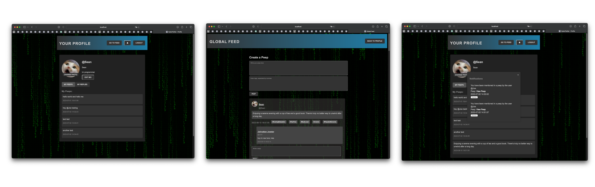

# CyberTwitter

CyberTwitter is a small Twitter clone web application built with Ruby, Sinatra, and JavaScript. It allows users to sign up, log in, post "peeps" (tweets), and view a feed of peeps from other users.

<p align="center">
 
 
 
 
 
 
 
 
</p>

<p align="center">
  
</p>

## JavaScript Version

If you prefer a JavaScript implementation of this project, you can check out the [JavaScript version](https://github.com/Shakhrai8/frontend-api-challenge). 

The JavaScript version focuses on the frontend and utilizes the provided backend API hosted on Heroku. It offers similar features to the Ruby version, including user account creation, peep posting, peep viewing, and more. Feel free to explore and compare the two implementations.

## Features

- User authentication: Sign up and log in securely.
- Posting peeps: Share your thoughts and updates with other users.
- Feed: View a chronological list of peeps from all users.
- Profile page: See your own profile with your posted peeps.

## Screenshots



## Local Development

To run CyberTwitter locally, follow the instructions below:

1. Clone the repository:

`git clone https://github.com/your-username/cybertwitter.git`

2. Navigate to the project directory:

`cd cybertwitter`

3. Install the required gems:

`bundle install`

4. Set up the database:

- Ensure you have PostgreSQL installed and running.
- Create a new database for CyberTwitter.
- Import the database schema using the `psql` command:

  ```
  psql -h 127.0.0.1 -d your_database_name < path/to/schema.sql
  ```

  Replace `your_database_name` with the name of your PostgreSQL database, and `path/to/schema.sql` with the actual path to your schema file.

5. Start the server:

`rackup`


The application will be running on `http://localhost:9292`.

## Dependencies

CyberTwitter relies on the following technologies, libraries, and tools:

- Ruby 2.7+
- Sinatra web framework
- WEBrick server
- JavaScript
- PostgreSQL database
- ActiveRecord ORM
- BCrypt for password hashing
- RSpec for testing
- SecureRandom for generating secure random tokens

## Testing

CyberTwitter includes a suite of RSpec tests to ensure its functionality is working correctly. You can run the tests using the following command:

`rspec`


## Routes

CyberTwitter includes the following routes:

- `GET /`: Home page of the application.
- `GET /signup`: Sign up page for creating a new user account.
- `POST /signup`: Endpoint for creating a new user account.
- `GET /login`: Login page for existing users.
- `POST /login`: Endpoint for user login.
- `GET /logout`: Endpoint for user logout.
- `GET /feed`: View the feed of all peeps.
- `GET /profile`: View the user's profile page.

Please refer to the application code for more details on each route's functionality.

## Contributing

Contributions are welcome! If you find any bugs or have suggestions for improvements, please open an issue or submit a pull request. Make sure to follow the existing code style and guidelines.

## License

This project is licensed under the [MIT License](LICENSE).

## Acknowledgements

CyberTwitter was developed as part of a learning project and is inspired by the Chitter Challenge. Special thanks to the contributors and the open-source community for their valuable resources and guidance.
